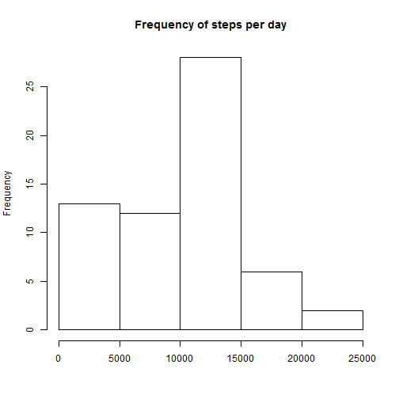
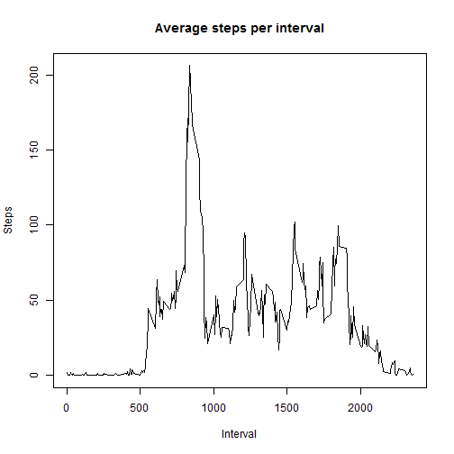
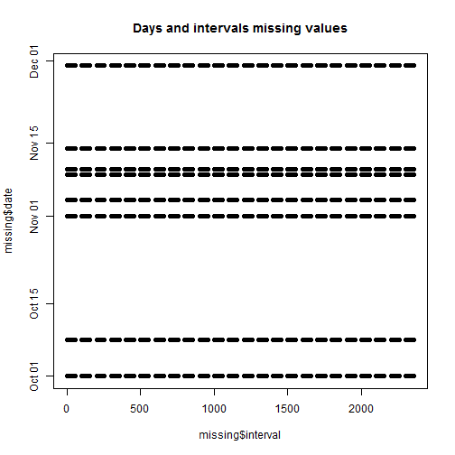
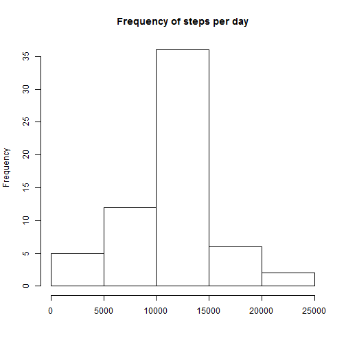
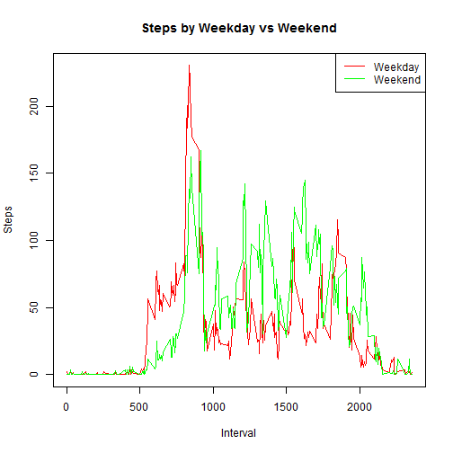

## Loading and preprocessing the data

The first thing we need to do is load the data. Then convert the date to an actual date format.


```r
activity<-read.csv("activity.csv")
activity$date<-as.Date(as.character(activity$date),"%Y-%m-%d")
```

## What is mean total number of steps taken per day?

First, collapse the data into a 'per day' data set.


```r
daytot<-with(activity,tapply(steps,date,sum,na.rm=TRUE))
```

Create a histogram. And calculate the mean and median of the dataset.


```r
hist(daytot,xlab="",main="Frequency of steps per day")
```

 

```r
print(paste("The mean is",mean(daytot,na.rm=TRUE)))
```

```
## [1] "The mean is 9354.22950819672"
```

```r
print(paste("The median is",median(daytot,na.rm=TRUE)))
```

```
## [1] "The median is 10395"
```

## What is the average daily activity pattern?

First, collapse the data into a 'per interval' data set. Then rearrange it back into a data frame.


```r
inttot<-with(activity,tapply(steps,interval,mean,na.rm=TRUE))
intdata<-data.frame(interval=unique(activity$interval),steps=as.numeric(inttot))
```

Now create a plot.


```r
plot(intdata$interval,intdata$steps,type="l",xlab="Interval",ylab="Steps",main="Average steps per interval")
```

 

And determine which interval has the maximum number of steps.


```r
maxint<-intdata[which.max(intdata$steps),]$interval
print(paste("The interval with the maximum steps is",as.character(maxint)))
```

```
## [1] "The interval with the maximum steps is 835"
```

## Imputing missing values

How many missing values are there? And where are they?


```r
print(paste("The total number of missing values is",sum(is.na(activity$steps))))
```

```
## [1] "The total number of missing values is 2304"
```

```r
missing<-activity[is.na(activity$steps),]
plot(missing$interval,missing$date,main="Days and intervals missing values")
```

 

From this we see that there are eight days with missing intervals. The simpliest strategy I will choose will be to fill those intervals with the averages over the days (ie the intdata dataset).

First we will construct a duplicate sized dataset. We know there are 61 days in the dataset.


```r
days<-unique(activity$date)
newdata<-data.frame(date=rep(days,each=length(intdata)),interval=rep(intdata$interval,length(daytot)),
                    steps=rep(intdata$steps,length(daytot)))
```

Now simply replace where the data is missing. (And let's make sure there is no missing data.)


```r
imputed<-activity
missingvector<-is.na(imputed$steps)
imputed[missingvector,]$steps<-newdata[missingvector,]$steps
print(paste("The total number of missing values is",sum(is.na(imputed$steps))))
```

```
## [1] "The total number of missing values is 0"
```

Now to repeat the question 1 plot.
First, collapse the data into a 'per day' data set.


```r
daytotimputed<-with(imputed,tapply(steps,date,sum))
```

Create a histogram. And calculate the mean and median of the dataset.


```r
hist(daytotimputed,xlab="",main="Frequency of steps per day")
```

 

```r
print(paste("The mean is",mean(daytotimputed)))
```

```
## [1] "The mean is 10766.1886792453"
```

```r
print(paste("The median is",median(daytotimputed)))
```

```
## [1] "The median is 10766.1886792453"
```

From this we see that the mean has increased, but the median has remained the same. This makes sense as we were only imputing 13% of the data, not enough to impact on the median, but we are imputing positive values, which would change the mean.

## Are there differences in activity patterns between weekdays and weekends?

First we need to add the variable. Then collapse the data as before, and reshape it.


```r
imputed$weekday<-as.factor(ifelse(weekdays(imputed$date) %in% c("Saturday","Sunday"), "Weekend", "Weekday")) 
impinttot<-with(imputed,tapply(steps,list(interval,weekday),mean))
impintdata<-data.frame(interval=rep(unique(imputed$interval),2),weekday=rep(c("weekday","weekend")
                  ,each=length(unique(imputed$interval))),steps=as.numeric(impinttot))
impweekday<-impintdata[impintdata$weekday=="weekday",]
impweekend<-impintdata[impintdata$weekday=="weekend",]
```

This is the plot.


```r
plot(impweekday$interval,impweekday$steps,type="l",col="red",
     ylab="Steps",xlab="Interval",main="Steps by Weekday vs Weekend")
lines(impweekend$interval,impweekend$steps,col="green")
legend("topright",legend=c("Weekday","Weekend"),lty=c(1,1),col=c("red","green"))
```

 
